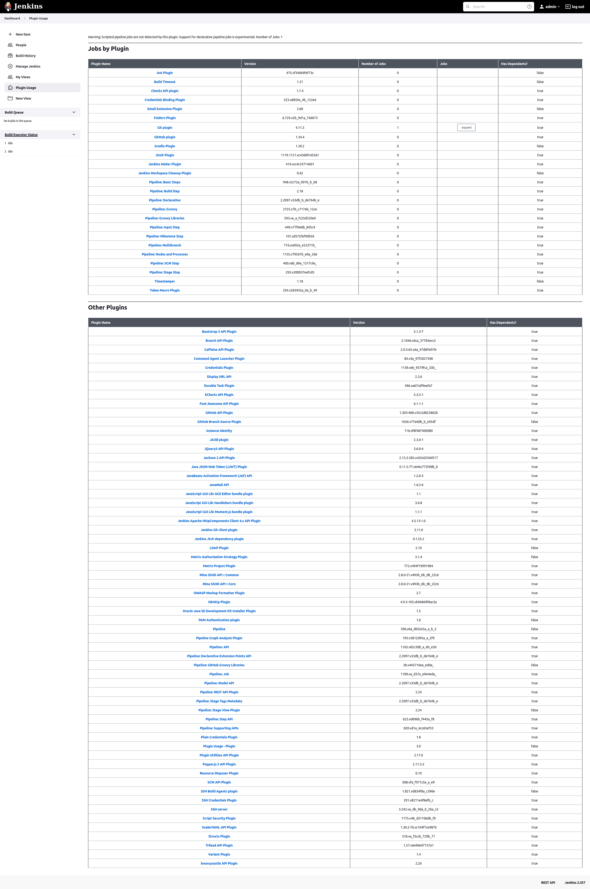

# Jenkins plugin-usage-plugin

This plugin gives you the possibility to analyze the usage of your
installed plugins.

## Usage

You can find the plugin on sidepanel of Jenkins. Every user is able to
use this plugin.

The plugin will give you a report on how much every plugin will be used
in all of your jobs (see the screenshot below). Therefore it will
analyze the used extension points of each job.
**Plugins used in pipeline scripts would not be listed normally as used
by jobs, because they are used dynamically in Jenkinsfiles.**

An API is also available (https://github.com/jenkinsci/plugin-usage-plugin/pull/18).

### User access

Authenticated users can access the Plugin Usage View if they have the Plugin View permission.

This is because plugin usage view exposes information about the installed plugin and versions which may be against organization security policies.

## Supported Extension points

This plugins will first iterate through jobs to gather those types of
extension points:

-   Builder
-   BuildWrapper
-   JobProperty
-   Publisher
-   SCM
-   Trigger
-   WorkflowJob
-   Maven

and will add other plugins at the end.
